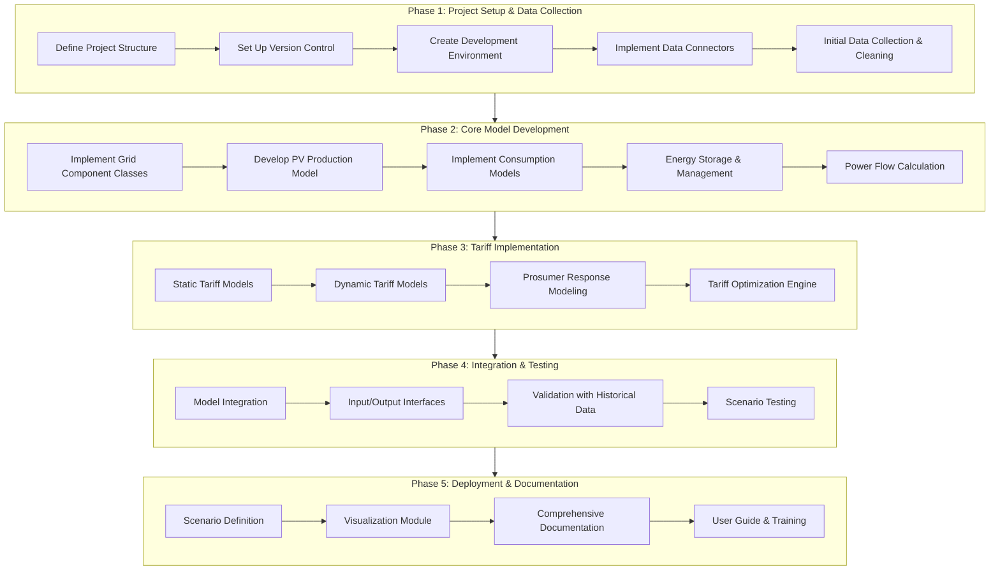
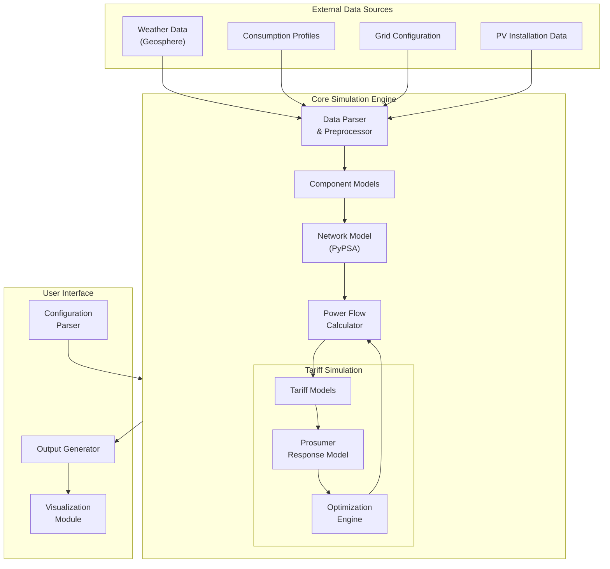

# Tariff Simulator for Engage PV

A dynamic tariff simulation tool for modeling electricity pricing impacts on PV integration in low-voltage networks.

> **This project has received funding from the Climate and Energy Fund in the context of the research and innovation programme "Energy Model Region -- Call 2021"**

## Project Overview

The Tariff Simulator models the effectiveness of dynamic grid and energy pricing under realistic conditions, focusing on PV system integration in low-voltage networks. This simulator aims to demonstrate how different tariff structures can incentivize optimal behavior from prosumers to improve grid stability and efficiency.

### Key Features

- Simulation of energy flows in a local grid segment (Netzebene 7)
- PV production modeling with configurable capacity and orientation
- Consumption modeling with flexible and inflexible loads
- Multiple tariff models (dynamic, time-of-use, power-limited)
- Prosumer response simulation
- Battery storage management strategies
- Comprehensive output visualizations

## System Architecture

### Development Workflow



### Technical Architecture



## Project Structure

```
tariff_simulator/
│
├── data/                      # Data storage directory
│   ├── weather/               # Weather data 
│   ├── grid/                  # Grid configuration
│   ├── consumption/           # Consumption profiles
│   └── pv/                    # PV installation data
│
├── config/                    # Configuration files
│   ├── simulation.yaml        # Simulation parameters
│   ├── tariffs.yaml           # Tariff models
│   └── scenarios.yaml         # Scenario definitions
│
├── src/                       # Source code
│   ├── __init__.py
│   ├── data/                  # Data handling modules
│   │   ├── __init__.py
│   │   ├── weather.py         # Weather data processing
│   │   ├── consumption.py     # Consumption data processing
│   │   └── grid.py            # Grid data processing
│   │
│   ├── models/                # Simulation models
│   │   ├── __init__.py
│   │   ├── pv.py              # PV generation model
│   │   ├── storage.py         # Energy storage model
│   │   ├── consumer.py        # Consumer model
│   │   └── network.py         # Grid network model
│   │
│   ├── tariffs/               # Tariff models
│   │   ├── __init__.py
│   │   ├── dynamic.py         # Dynamic tariff models
│   │   ├── static.py          # Static tariff models
│   │   └── response.py        # Prosumer response model
│   │
│   ├── simulation/            # Simulation engine
│   │   ├── __init__.py
│   │   ├── engine.py          # Main simulation engine
│   │   ├── optimizer.py       # Optimization algorithms
│   │   └── timestepper.py     # Time stepping control
│   │
│   └── visualization/         # Visualization modules
│       ├── __init__.py
│       ├── plots.py           # Plotting functions
│       └── reports.py         # Report generation
│
├── tests/                     # Test directory
│   ├── __init__.py
│   ├── test_data.py
│   ├── test_models.py
│   └── test_tariffs.py
│
├── notebooks/                 # Jupyter notebooks for analysis
│   ├── data_exploration.ipynb
│   └── results_analysis.ipynb
│
├── requirements.txt           # Project dependencies
├── setup.py                   # Package setup script
└── README.md                  # Project documentation
```

## Installation & Setup

### Prerequisites

- Python 3.10 or higher
- Git
- Access to required data sources

### Installation

1. Clone the repository:
   ```bash
   git clone https://github.com/your-organization/tariff-simulator.git
   cd tariff-simulator
   ```

2. Create and activate a virtual environment:
   ```bash
   python -m venv venv
   source venv/bin/activate  # On Windows: venv\Scripts\activate
   ```

3. Install dependencies:
   ```bash
   pip install -r requirements.txt
   ```

4. Configure data connections:
   - Edit the appropriate configuration files in the `config/` directory
   - Set up API credentials for weather data access

## Usage

### Basic Operation

1. Prepare input data:
   - Ensure weather data is available in `data/weather/`
   - Configure PV systems and consumers in respective configuration files

2. Define simulation parameters:
   ```bash
   # Edit config/simulation.yaml to define simulation parameters
   ```

3. Run a simulation:
   ```bash
   python -m tariff_simulator.run --config config/simulation.yaml
   ```

4. View results:
   - Output CSV files will be available in the configured output directory
   - Visualization scripts will generate graphs for key metrics

### Configuration Options

The simulator uses YAML configuration files located in the `config/` directory:

- `simulation.yaml`: Defines simulation parameters such as time range, resolution, and output settings
- `tariffs.yaml`: Defines tariff models and their parameters
- `scenarios.yaml`: Defines scenarios combining different grid configurations, PV penetration levels, and tariff models

Example configuration:

```yaml
# simulation.yaml example
simulation:
  start_time: "2025-01-01 00:00:00"
  end_time: "2025-01-07 23:59:59"
  resolution: "15min"
  output_dir: "results/baseline_scenario"

grid:
  config_file: "data/grid/baumgarten_trafo1.csv"
  voltage_limits:
    min: 0.9
    max: 1.1

weather:
  source: "geosphere"
  location: "Baumgarten"
  cache: true
```

## Tariff Models

The simulator supports several tariff models:

1. **Static Tariffs**: Fixed rates for consumption and feed-in
2. **Time-of-Use Tariffs**: Different rates based on time of day
3. **Dynamic Residual-Load Based**: Rates that vary based on local grid residual load
4. **Power Limitation Tariffs**: Incentives for limiting peak power consumption/feed-in

These can be configured with various parameters to simulate different regulatory approaches.

## Development - UNDER CONSTRUCTION!

### Technology Stack

- **Core Language**: Python 3.10+
- **Data Processing**: Pandas, NumPy
- **Grid Modeling**: PyPSA
- **Visualization**: Matplotlib, Plotly
- **Configuration**: YAML
- **Testing**: pytest

### Development Workflow

1. Set up the development environment as described in the Installation section
2. Create a feature branch for your work:
   ```bash
   git checkout -b feature/your-feature-name
   ```
3. Implement and test your changes
4. Write appropriate unit tests in the `tests/` directory
5. Ensure all tests pass:
   ```bash
   pytest
   ```
6. Submit a pull request for review

### Coding Standards

This project follows PEP 8 style guidelines. We use:
- Black for code formatting
- isort for import sorting
- flake8 for linting

## Contributing

We welcome contributions to the Tariff Simulator project. Please follow these steps:

1. Fork the repository
2. Create a feature branch
3. Make your changes
4. Add or update tests as necessary
5. Update documentation
6. Submit a pull request

## Responsibilities

- **Functionality & Design**: [TBD]
- **Data Acquisition**: [TBD]
- **Tariff Models**: [TBD]
- **Programming**: [TBD]
- **Testing**: [TBD]

## License

[Specify your license here]

## Contact

For questions about the Tariff Simulator, please contact:
- [Contact Person]
- [Email Address]

## Acknowledgments

This project is part of the Engage PV research initiative, funded by the Climate and Energy Fund in the context of the research and innovation programme "Energy Model Region -- Call 2021".

## References

- Network tariffs for Austrian federal states: [E-Control Document](https://www.e-control.at/documents/1785851/0/Systemnutzungsentgelte+Strom+-+Novelle+2024.pdf/641dc620-760f-5ad9-e570-00619b01a19a?t=1713527609036)
- [Add other relevant references]
